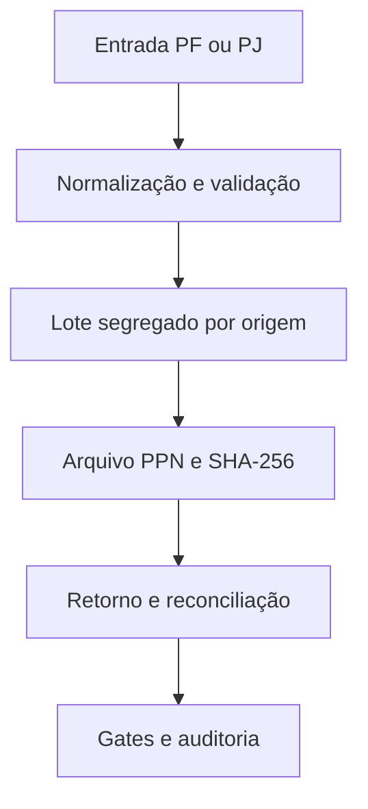

# Arquitetura da fundação V2.0

## Fluxo operacional

O domínio conhece origem, identidade, estados, lotes e reconciliação. Formatos e
provedores ficam atrás de adaptadores. A estrutura específica do PPN não entra
nas regras PF/PJ.

## Topologia por etapas

### Etapa atual

- Google Sheets e Drive permanecem como fonte e repositório documental legado;
- Apps Script V1.8.5 permanece congelado como baseline homologada;
- o cockpit Apps Script lê somente contagens agregadas;
- TypeScript concentra contratos e regressões portáveis;
- não há banco de dados, consulta SQL, endpoint público ou deploy.

### Evolução prevista

- `apps/web`: interface responsiva completa;
- `apps/api`: serviço stateless;
- `apps/worker`: processamento persistente;
- PostgreSQL: estado transacional e concorrência;
- Drive: adaptador de documentos;
- Correios PPN: adaptador de integração.

A evolução exige novo ADR e gate próprio. Este repositório não antecipa schema,
migration, seed, credencial ou consulta de banco.

## Limites de dados

- nenhum cadastro PF/PJ é versionado;
- nenhuma linha de exemplo dos templates oficiais é versionada;
- códigos, documentos e CEPs são tratados como texto;
- artefatos operacionais permanecem fora do Git;
- contagens do cockpit são calculadas em tempo de execução;
- arquivos gerados devem receber SHA-256 antes de mudar de gate.
