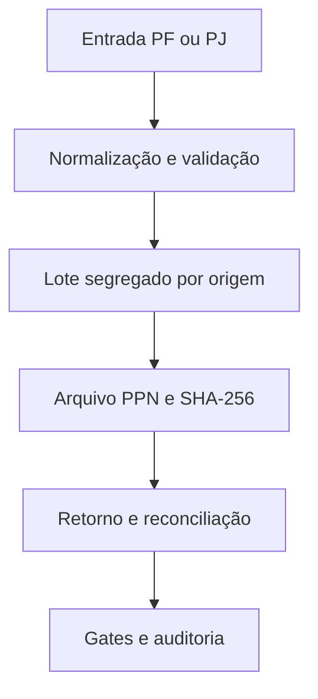

# Arquitetura da fundação V2.0

## Fluxo operacional

O domínio conhece origem, identidade, estados, lotes e reconciliação. Formatos e
provedores ficam atrás de adaptadores. A estrutura específica do PPN não entra
nas regras PF/PJ.

## Topologia por etapas

### Etapa anterior

- Google Sheets e Drive permanecem como fonte e repositório documental legado;
- Apps Script V1.8.5 permanece congelado como baseline homologada;
- o cockpit Apps Script lê somente contagens agregadas;
- TypeScript concentra contratos e regressões portáveis;
- não havia banco de dados nem consulta SQL;
- o único endpoint novo é o webhook efêmero da homologação de e-mail no Preview,
  desabilitado sem configuração explícita e sem persistência operacional.

### Etapa atual — persistência operacional

- PostgreSQL 16 mantém o estado transacional;
- intake preserva linhas duplicadas na área de ingestão;
- cadastro canônico usa documento cifrado e fingerprint HMAC por origem;
- confirmações são consumidas por compare-and-set atômico;
- criação de lote, comunicação, confirmação, outbox e auditoria ocorre em uma
  única transação;
- workers reservam outbox com `FOR UPDATE SKIP LOCKED`;
- OAuth e payloads permanecem cifrados; Gmail API ainda não foi implementada.

### Evolução seguinte

- `apps/web`: interface responsiva completa;
- `apps/api`: serviço stateless;
- `apps/worker`: processamento persistente;
- Drive: adaptador de documentos;
- Gmail: adapter server-side alimentado pela outbox;
- Correios PPN: adaptador de integração.

Cada integração externa exige gate próprio. Esta etapa não inclui seed, credencial,
chamada Gmail, envio operacional ou consulta a banco de produção.

## Limites de dados

- nenhum cadastro PF/PJ é versionado;
- nenhuma linha de exemplo dos templates oficiais é versionada;
- nenhum dado cadastral aparece em migrations ou testes;
- códigos, documentos e CEPs são tratados como texto;
- artefatos operacionais permanecem fora do Git;
- contagens do cockpit são calculadas em tempo de execução;
- arquivos gerados devem receber SHA-256 antes de mudar de gate.
